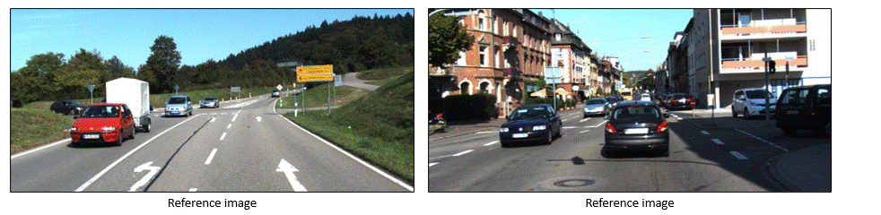

## BiTTC &mdash; Official PyTorch Implementation<br>

<br>

**Binary TTC: A Temporal Geofence for Autonomous Navigation**<br>
*CVPR 2021 (Oral), Best Student Paper Honorable Mention*<br>
Abhishek Badki, Orazio Gallo, Jan Kautz, and Pradeep Sen<br>

## Abstract: 
*Time-to-contact (TTC), the time for an object to collide with the observer's plane, is a powerful tool for path planning: it is potentially more informative than the depth, velocity, and acceleration of objects in the scene---even for humans. TTC presents several advantages, including requiring only a monocular, uncalibrated camera. However, regressing TTC for each pixel is not straightforward, and most existing methods make over-simplifying assumptions about the scene. We address this challenge by estimating TTC via a series of simpler, binary classifications. We predict with* low latency *whether the observer will collide with an obstacle* within a certain time, *which is often more critical than knowing exact, per-pixel TTC. For such scenarios, our method offers a temporal geofence in 6.4 ms---over 25x faster than existing methods. Our approach can also estimate per-pixel TTC with arbitrarily fine quantization (including continuous values), when the computational budget allows for it. To the best of our knowledge, our method is the first to offer TTC information (binary or coarsely quantized) at sufficiently high frame-rates for practical use.*

## Paper:
http://arxiv.org/abs/2101.04777<br>

## Videos:<br>
<a href="https://youtu.be/uUQJcjyerM4">
  
</a>

## Citing BiTTC:
    @InProceedings{badki2021BiTTC,
    author = {Badki, Abhishek and Gallo, Orazio and Kautz, Jan and Sen, Pradeep},
    title = {{B}inary {TTC}: {A} Temporal Geofence for Autonomous Navigation},
    booktitle = {The IEEE Conference on Computer Vision and Pattern Recognition (CVPR)},
    year = {2021}
    }

or the arXiv paper

    @InProceedings{badki2021BiTTC,
    author = {Badki, Abhishek and Gallo, Orazio and Kautz, Jan and Sen, Pradeep},
    title = {{B}inary {TTC}: {A} Temporal Geofence for Autonomous Navigation},
    booktitle = {arXiv preprint	arXiv:2101.04777},
    year = {2021}
    }


## Code:<br>

### License

Copyright 2021 NVIDIA CORPORATION & AFFILIATES

Licensed under the [NVIDIA Source Code License](LICENSE.md)

### Setup

#### Conda
All dependencies will be installed automatically using the following:
```
conda env create -f env/bittc_conda_env.yml 
```
You can activate the environment by running:
```
conda activate bittc
```

### Pre-trained models
Download the pre-trained models [here](https://drive.google.com/file/d/1YjotthiLZOLtED8PkZ5NbL6zdOQo-Ovx).

### Run the demo

```
cd src
# RUN DEMO FOR BINARY TTC AND OF ESTIMATION
bash run_binary_demo.sh
# RUN DEMO FOR CONTINUOUS TTC AND OF ESTIMATION
bash run_continuous_demo.sh
```